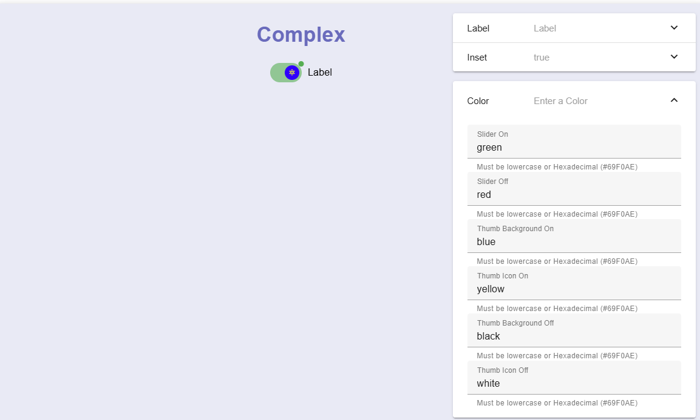

# How to use
1) Navigate to different components using the navigation drawer on the top left. (Only Buttons and Selects page is currently active)
2) Change to the individual or shared tab to work on personal or collaborative projects. (Shared page is currently in progress)
3) Each component can be edited/ experimented with using the panel on the right hand side of the respective component by clicking on the respective property/ properties you would like to edit on the panel and changing it. 
4) Components can now be searched using the magnifying icon at the top.
5) Components search filter can also now be changed by using the filter Icon at the top.
6) Components can now have there states exported to a file, which can be shared as well as import the selected files to reload the component values.

# Current Features
1) Different Buttons and Selects can be accessed and experimented with by navigating to respective webpage using the navigation drawer on the top left and selecting the individual tab.
2) Different Types of the same component can be searched with filters.
3) Components can be exported/ imported for sharing or for backups.
4) The search can be pre-filled by clicking on the Component Name (Title) or Author.

# Things being worked on
1) Adding More types of components
2) Shared functionality for collaboration

# Known bugs/ issues
1) Webpage sometimes makes a blank space near the top of the screen when switching between shared and individual tabs. (Visual glitch only) (Should be fixed now using the new app bar search)
2) Warnings occur when parsing "auto" to either the width or height properties of the Styled Button, but does not appear to break any functionality.

# Things to note after downloading project from gitHub
After installing all the required setup Dependencies listed below, ensure that the "nuxt_modules" folder is in the main project directory.
 
# Nuxt Minimal Starter

Look at the [Nuxt documentation](https://nuxt.com/docs/getting-started/introduction) to learn more.

## Setup

Make sure to install dependencies:

```bash
# npm
npm install

# pnpm
pnpm install

# yarn
yarn install

# bun
bun install
```

## Development Server

Start the development server on `http://localhost:3000`: by running one of the commands below

```bash
# npm
npm run dev

# pnpm
pnpm dev

# yarn
yarn dev

# bun
bun run dev
```

## Production

Build the application for production:

```bash
# npm
npm run build

# pnpm
pnpm build

# yarn
yarn build

# bun
bun run build
```

Locally preview production build:

```bash
# npm
npm run preview

# pnpm
pnpm preview

# yarn
yarn preview

# bun
bun run preview
```

Check out the [deployment documentation](https://nuxt.com/docs/getting-started/deployment) for more information.

